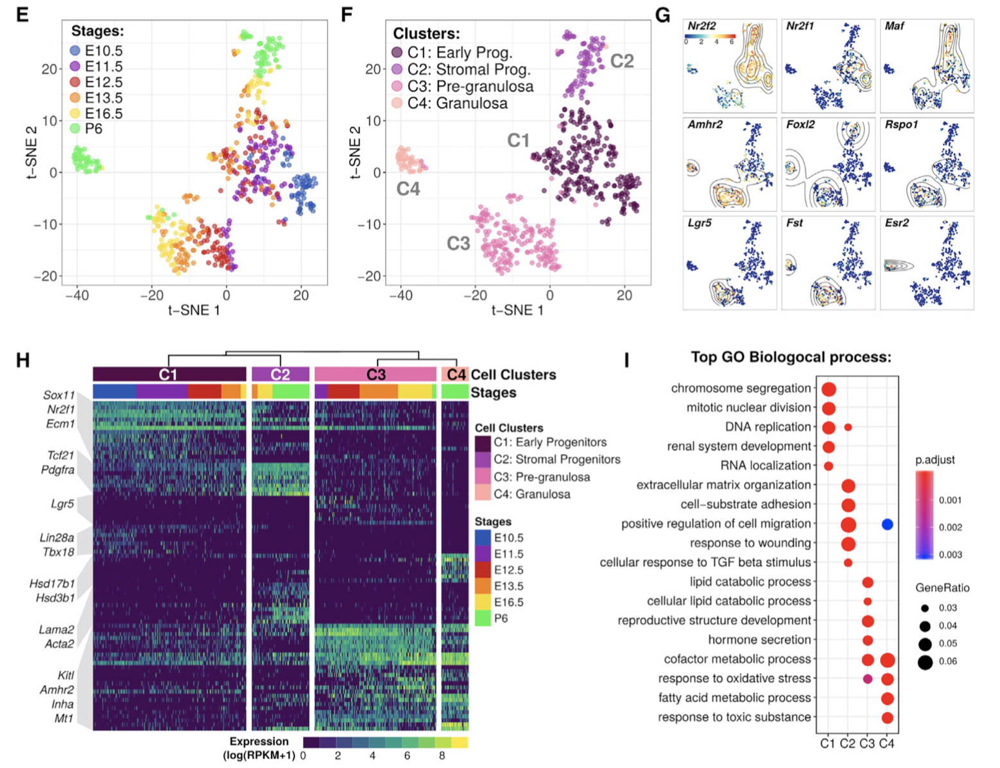
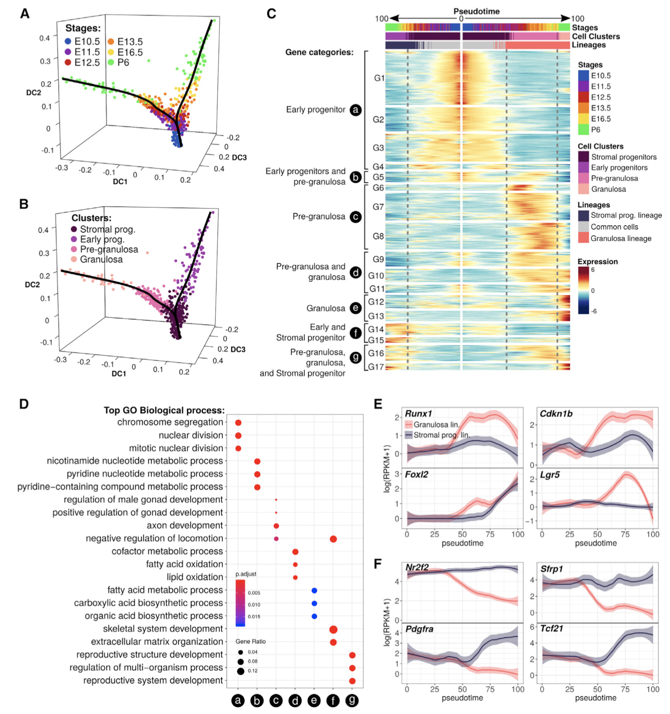

因为本研究跟我们的全网第一个单细胞转录组课程所讲解的一样，都是采用SMART-SEQ2技术，就是测的细胞数量不多，但是能检测到的基因数量还蛮可观的单细胞转录组流派，跟10X相反，所以我们这里并不会过多介绍上游流程了，基本说等同于全网第一个单细胞转录组课程：<https://github.com/jmzeng1314/scRNA_smart_seq2> 

### 表达矩阵获取

第一篇文章：We collected gonads from NR5A1-eGFP transgenic embryos at five embryonic stages: E10.5, E11.5, E12.5, E13.5, E16.5.

- <https://www.ncbi.nlm.nih.gov/geo/query/acc.cgi?acc=GSE97519>

第二篇文章：We collected gonads from NR5A1-eGFP transgenic embryos at six embryonic stages: E10.5, E11.5, E12.5, E13.5, E16.5 and P6.

- <https://www.ncbi.nlm.nih.gov/geo/query/acc.cgi?acc=GSE119766>

在GEO页面可以看到表达矩阵下载地址，两篇文章的单细胞转录组策略都是 Cells were capture with the C1 autoprep system and cDNA sequenced with Illumina HiSeq 2000.

### 需要复现的图表

第一幅图：

可以看到，主要是表达矩阵进行分群，然后可视化不同群的marker基因，包括热图和热力图等等，还有这些基因的GO/KEGG数据库注释。



第二幅图

可以看到，主要是发育谱系推断，然后探索不同发育分享基因表达量的变化，以及不同变化情况的基因的GO/KEGG数据库注释。



### 视频课程大纲

Smart-seq2单细胞（发育）

- 上游分析等同于常规bulk转录组
  - 配置服务器
  - 配置软件及数据库文件
  - 下载sra文件并且转为fq测序文件
  - 走**hisat2比对+featureCount定量**流程得到表达矩阵
  - 走salmon流程得到表达矩阵
- 下游分析（纯粹R代码）
  - **比对3个表达矩阵的一致性**
  - 细胞分群（seurat和tSNE+DBSCAN/K-means）
  - 可视化**marker基因**
  - 差异基因集**功能注释及可视化**
  - 细胞发育谱系推断
  - **不同谱系**的差异基因分类注释

### 主要是6个文件夹代码

每个文件夹都是单独的项目，分别独立复现需要的图表的部分，进入文件夹打开后缀是 `Rproj` 的文件就会自动调用你系统的Rstudio软件，从而定位到项目，代码独立运行顺序运行即可。

```
step1-tSNE-female-RPKM
step2-heatmap-marker-genes
step3-DEG-annotation
step4-DEG-heatmap
step5-Slingshot
step6-monocle
```

